# Teetoise – Full Stack Project Management App

Teetoise is a full-stack productivity and collaboration tool built using modern web technologies. It enables teams to manage projects and tasks efficiently, inspired by tools like Trello, GitHub Projects, and Notion.

---

### Quick Links

- Main Repository: [teetoise-main](https://github.com/Raj0168/teetoise-main)
- Frontend Repo: [teetoise-frontend](https://github.com/Raj0168/teetoise-frontend)
- Backend Repo: [teetoise-backend](https://github.com/Raj0168/teetoise-backend)
- GitHub Project Board: [Teetoise – Project Board](https://github.com/users/Raj0168/projects/1)

---


---

## Preview

All screenshots are taken from the live version of the application before it was taken offline. The application was fully responsive and production-ready.

### Login Page

User login screen with email/password. <br />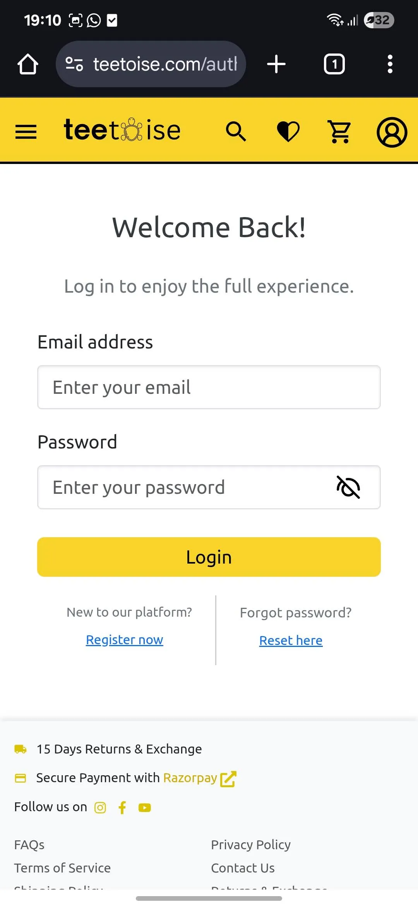

### Register Page

User registration screen with input validation. <br />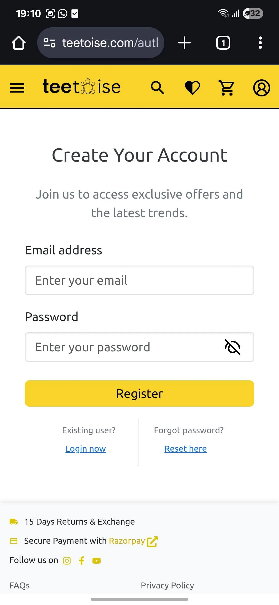

### Home Page – Banner and Promotions

Landing page with promotional banners and featured collections. <br />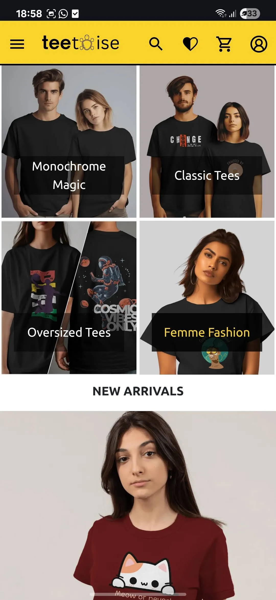

### Home Page – Featured Products

Section showcasing trending and new arrival items. <br />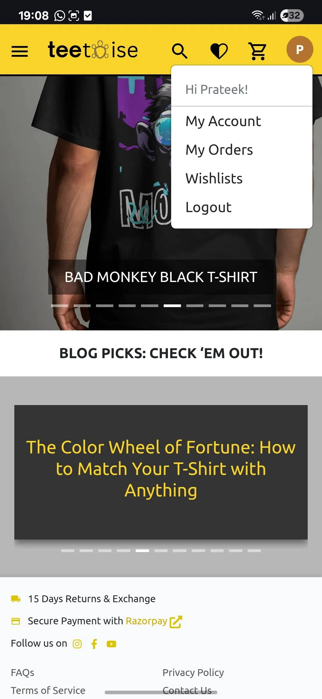

### Sidebar Navigation

Accessible sidebar menu optimized for mobile users. <br />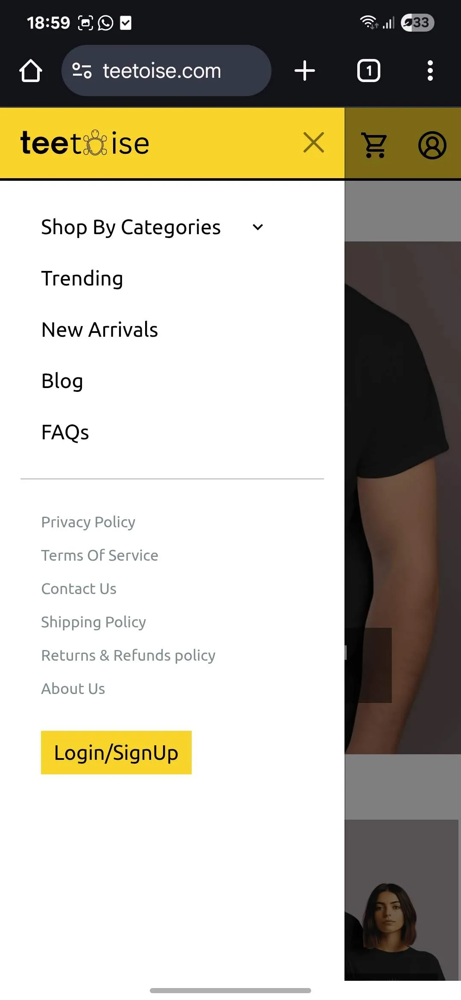

### Product Overview

Grid layout of product listings with filters. <br />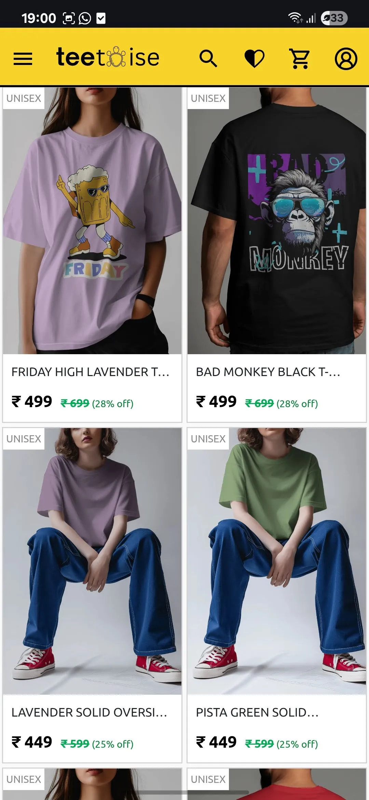

### Product Details Page

Detailed product information with image gallery and color, size options. <br />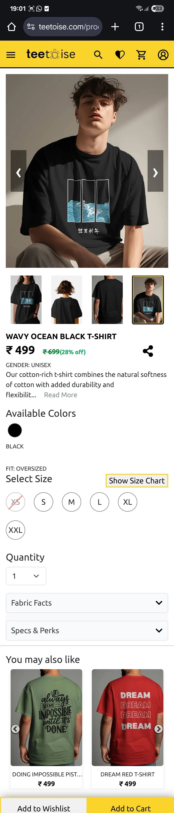

### Product Filters

Category, price range, and size filters. <br />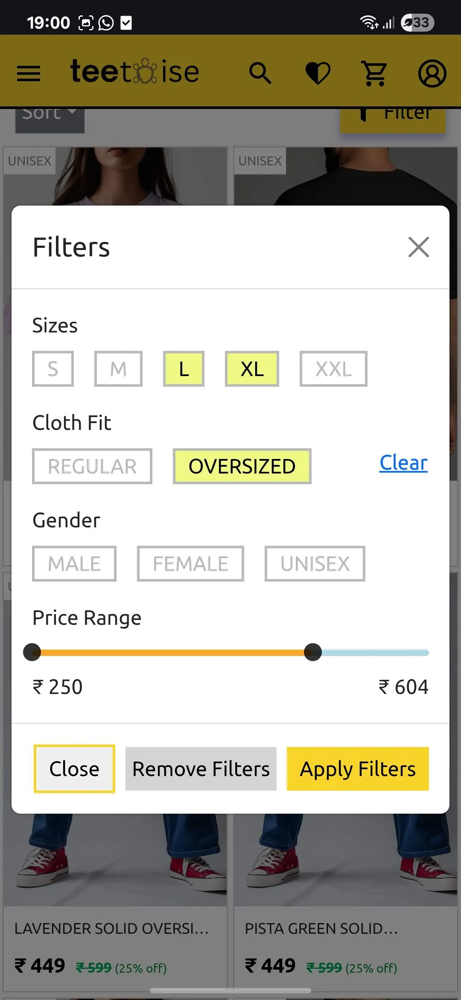

### Alternate Product View

Product manufacturer and quality details. <br />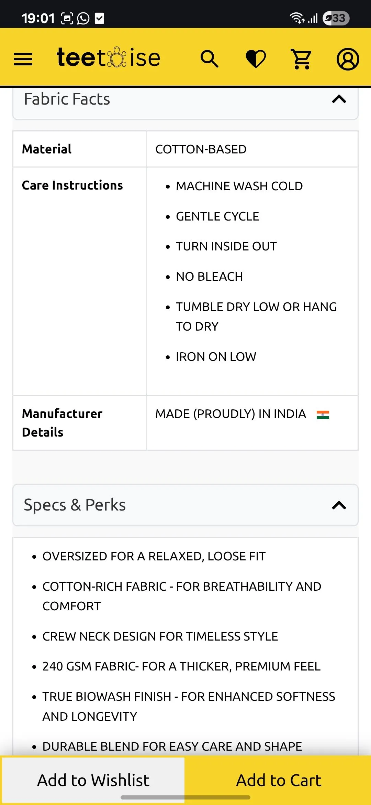

### Wishlist Page

View and manage all saved products. <br />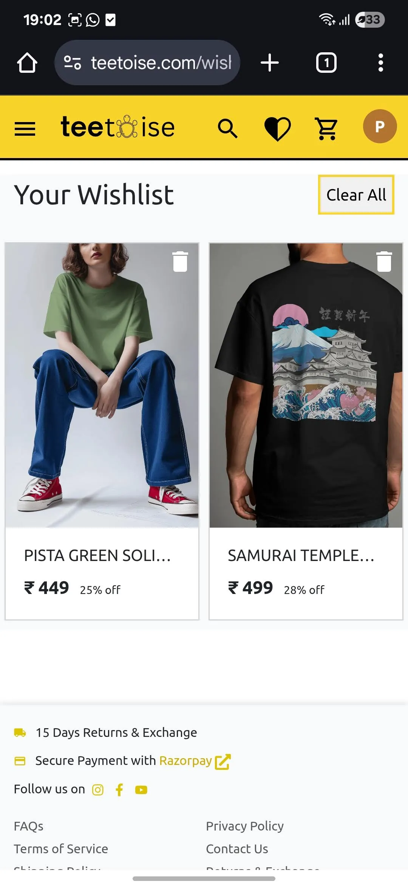

### Cart Page

Interactive cart with quantity, variant, and size management. <br />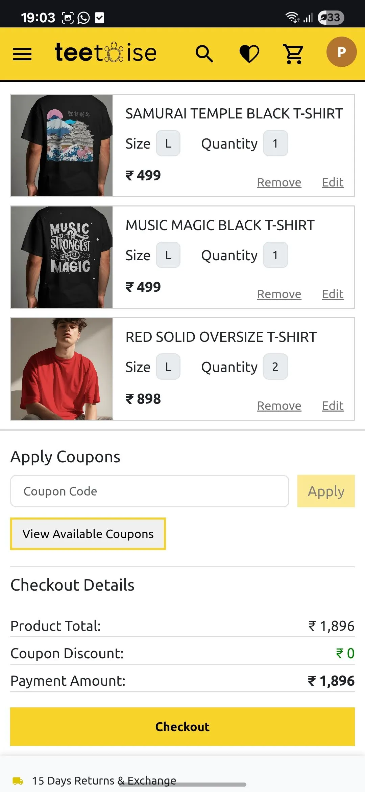

### Checkout Page

Delivery address input and summary before payment. <br />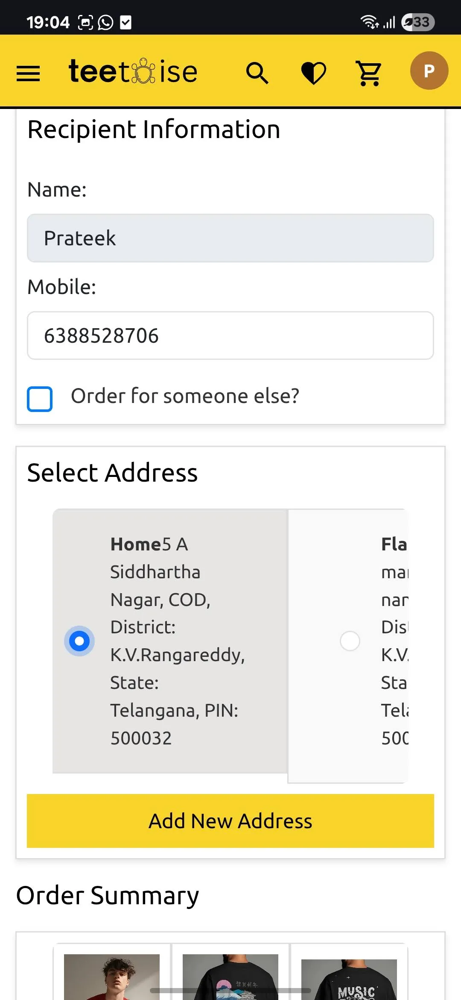

### Payment Gateway

Razorpay integration for secure transactions. <br />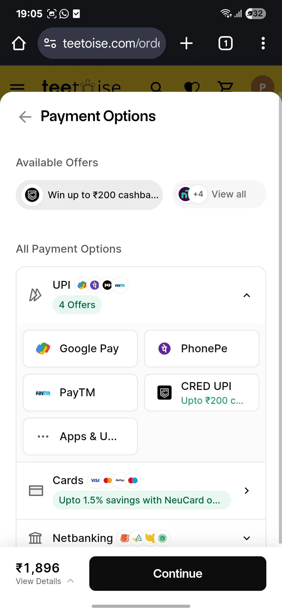

### Orders Overview

List of all past orders. <br />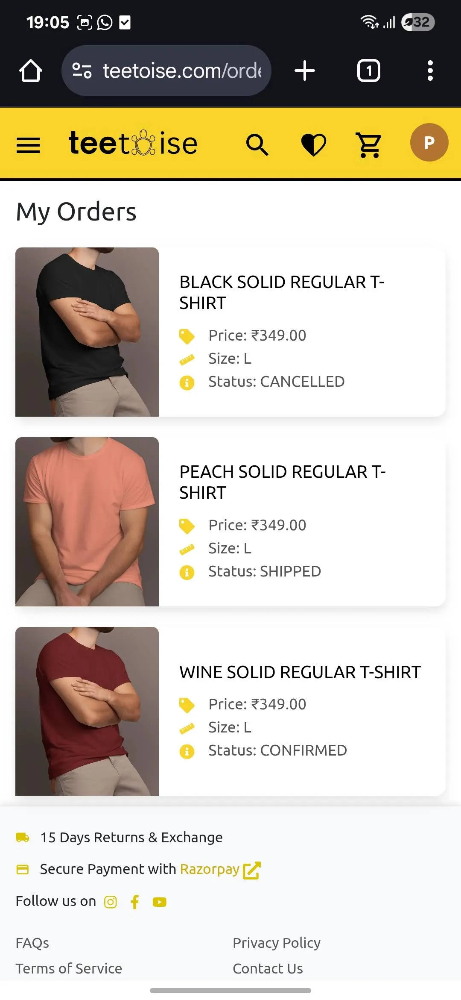

### Order Details Page

In-depth view with delivery status and item breakdown. <br />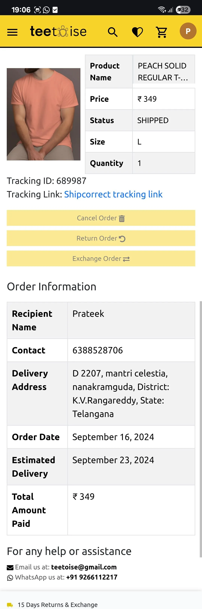

### User Account Details

Profile settings and address management. <br />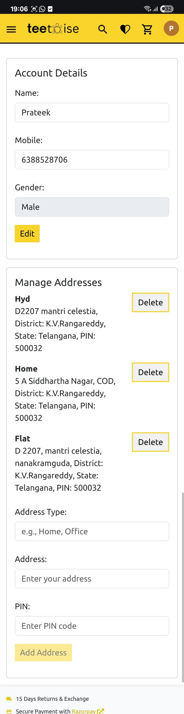

### About Us

Static page with brand mission and story. <br />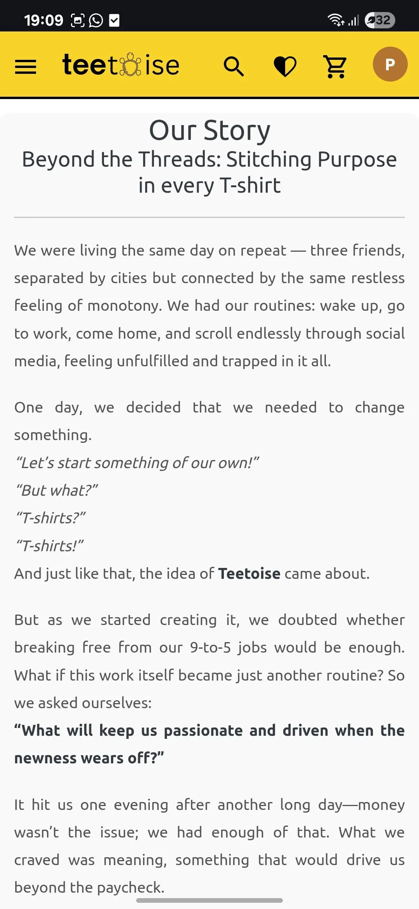

### FAQs

Frequently asked questions section. <br />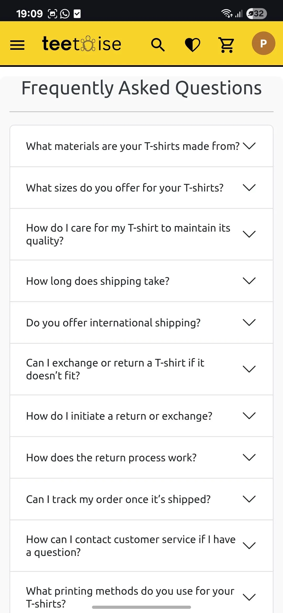

Example:

```markdown

```

---

## Features

- User Authentication (JWT)
- Project Management
- Role-based Access Control
- Backend API with RESTful Routes
- Frontend Built with React + Material UI
- Project Tracking via GitHub Projects

---

## Tech Stack

| Category     | Tech                                  |
| ------------ | ------------------------------------- |
| Frontend     | React, Vite, Material UI, SCSS, Redux |
| Backend      | Node.js, Express, PostgreSQL          |
| DevOps/Infra | AWS EC2, Amplify                      |
| Project Mgmt | GitHub Projects                       |

---

## Local Setup

### Frontend

```bash
git clone https://github.com/Raj0168/teetoise-frontend
cd teetoise-frontend
npm install
npm run dev
```

### Backend

```bash
git clone https://github.com/Raj0168/teetoise-backend
cd teetoise-backend
npm install
npm run dev
```

Make sure you configure your `.env` file for backend and frontend. Refer to each repo’s README for specific environment variables.

---

## Project Management Workflow

All features were organized and tracked using the [GitHub Project Board](https://github.com/users/Raj0168/projects/2).  
Tasks such as `Frontend Development`, `Backend Development`, and `DevOps & Infrastructure` were completed with clean separation and progress tracking.

## Author

Created by [Raj0168](https://github.com/Raj0168).  
For more projects and contact details, check out my GitHub profile.

---

## License

This project is licensed under the MIT License - see the [LICENSE](https://github.com/Raj0168/teetoise-main/blob/main/LICENSE) file for details.
